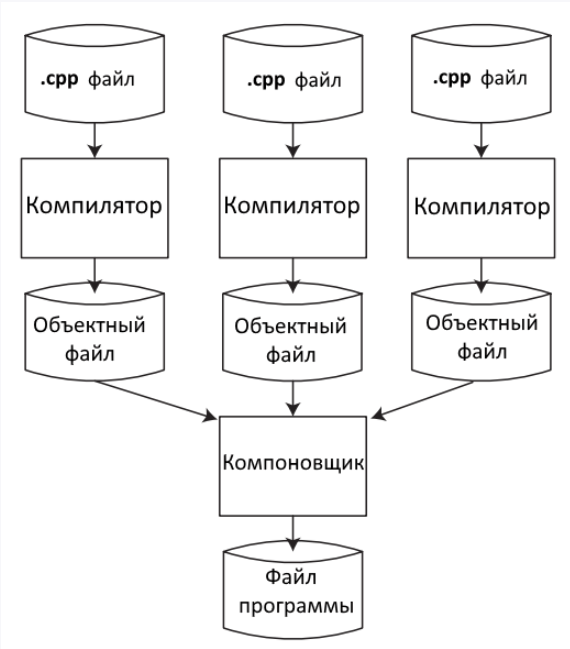

# Введение в C++ #

## Язык программирования С++ ##
Язык программирования С++ представляет представляет высокоуровневый компилированный язык программирования общего назначения со статической типизацией.
своими корнями он уходит в язык С который был разработав в 1969-1973 годах в компании Bell Labs Денниса Ритчи.
Вначале 80-х годов датский программист Бьерн Страуструп который работал в компании Bell Labs разработал С++ как расширение к языку С. Фактически в начале С++ просто дополнял язык С с некоторыми возможностями ООП. Изначально он назывался "Си с классами".
С++ является компилированным языком а это значит что компилятор транслирует исходный код на С++ в исполняемый файл, который содержит набор машинных инстркукций.

### Основные компиляторы: ###
1) G++
2) cland
3) компилятор Microsoft VS

### Состав компилятора С++: ###
1) CPP- процессор
2) AS-ассемблер
3) G++- сам компилятор
4) Id- линкер

### Зачем нужно скомпилировать файлы ###
Исходный С++ файл это всего лишь код, но его нельзя запустить как программу и использовать как библиотеку, поэтому каждый исходный файл требует скомпилировать в исполняемый.

### Этапы компиляции ###
1) Препроцессинг - это макропроцессор который преобразовывает программу в для дальнейшего компилировавния. На данной стадии происходит работа с препроцессорными директивами.(Например: добавления HEader-код (#include), убирает комментарии)
2) Компиляция (преобразование в ассемблерный код) - это промежуточный шаг между высокоуровневым языком и машинным кодом.
 
  

3) Ассемблирование- перевод ассемблерного кода в машинный.
Объектный файл созданный ассемблеров временный файлом хранящий кусок машинного кода.
Этот кусок машинного кода, который еще не был связан с другими кусками машинного кода называется объектным кодом.
4) Компоновка 
Компоновщик(Линкер) связывает все объектные файлы и статические библиотеки в единый исполняемый файл который мы можем запустить
5) Загрузка

Задание: Опишите структуру С++ в VS объясните каждый файл

Структура типичного проекта C++ в Visual Studio состоит из следующих файлов: 
| Файл | Назначение |
|---|---|
| `ИмяРешения.sln` | Главный контейнер. Объединяет несколько проектов, хранит их список и зависимости. |
| `ИмяПроекта.vcxproj` | Основной файл настроек сборки (XML). Содержит списки исходных (`.cpp`) и заголовочных (`.h`) файлов, пути к библиотекам, параметры компилятора для разных режимов (*Debug/Release*) и настройки платформы. |
| `ИмяПроекта.vcxproj.filters` | Отвечает за визуальные папки в «Обозревателе решений» (например, *Header Files* или *Source Files*). Не влияет на реальную структуру папок на диске. |
| `ИмяПроекта.vcxproj.user` | Ваши личные настройки отладки: аргументы командной строки, рабочая директория, переменные окружения. Обычно не добавляется в *.gitignore*. |
| Папки *Debug / Release* | Места хранения результатов сборки — исполняемых файлов (`.exe`), объектных файлов (`.obj`) и баз данных программы (`.pdb`). |
| `Directory.Build.props` | (Опционально) Общий файл для задания одинаковых правил сборки сразу для всех проектов в папке. |

Файлы .vcxproj и .filters можно открыть обычным Блокнотом, так как они имеют текстовый XML-формат.
